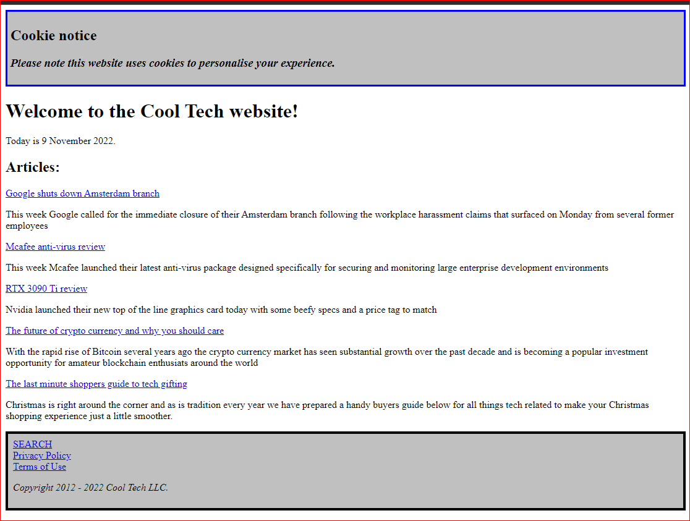
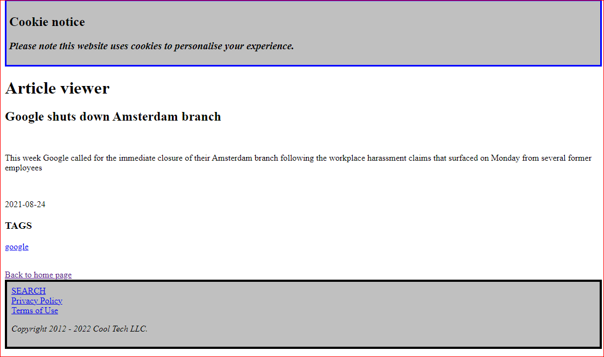
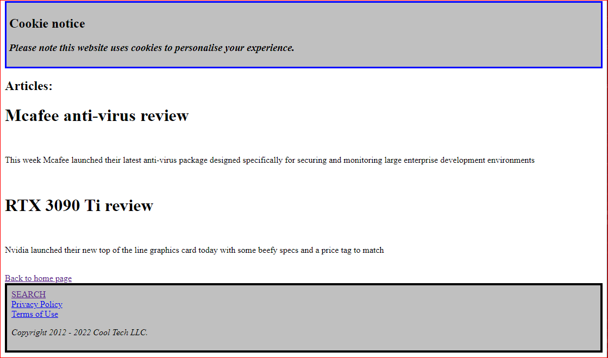

# cool-tech
Blog page for fictitious company, Cool Tech. Made with PHP &amp; Laravel

This application is designed to function as a fictitious blogging website for Cool Tech, a fake tech news company.

The application allows articles matching either a specified category or one or more specified tags to be searched for and displayed to the user. 

A list of recent posts can also be viewed on the home page as shown below.

To view an article simply click on its title which should highlighted as a hyperlink. This will take you to the article viewing page as shown below.

To search for an article using either its tags, category, or ID number simply enter what you wish to search for in the appropriately labelled fields as shown in the example and click the button directly below it to perform the search. The example below shows the search function being used to search for articles with a specific tag.

The results of the search will then be displayed following this as shown below.

To view articles with a specic tag directly from the article viewer page simpy click the hyperlinked tag listed underneath the Tags list of the article.

This will then display all articles with the relevant tags as shown below.

